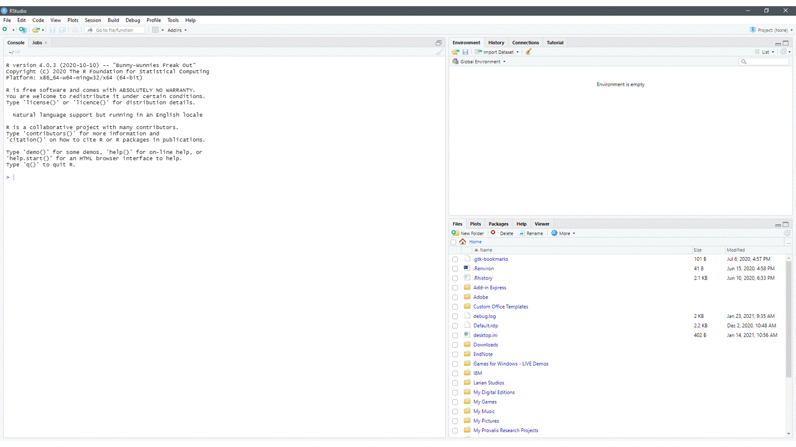
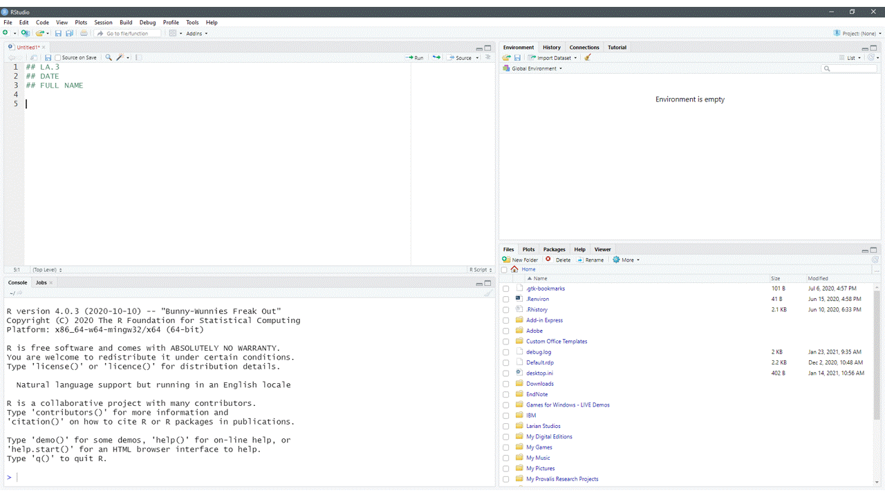
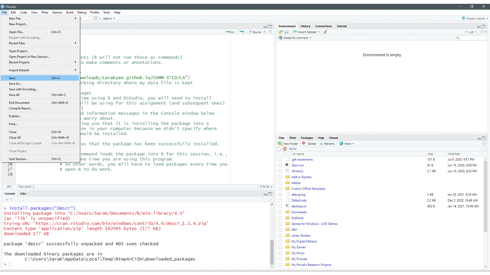
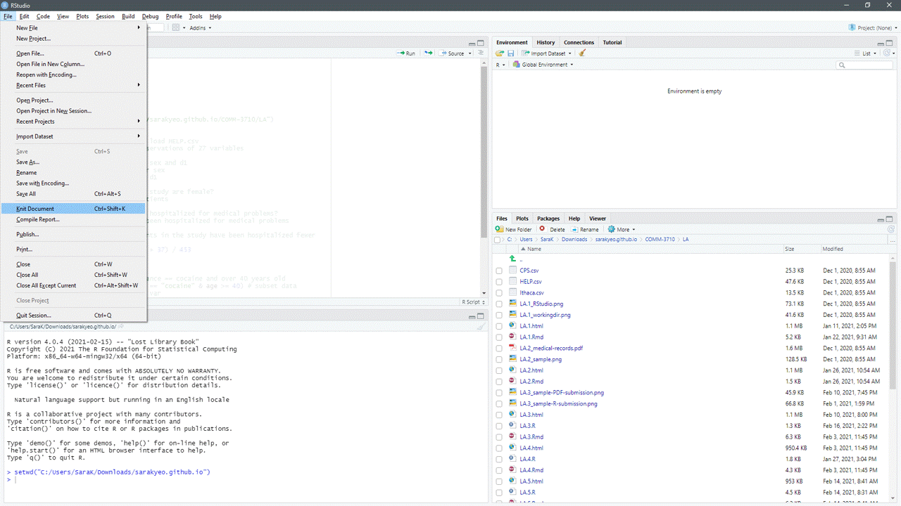

# Setting Up R for Assignments {#setup}

In this course you will use R for individual lab assignments and group project components. This chapter walks you through setting up R in preparation for completing assignments. Although you may have to refer to this chapter the first few times you set up R, you will soon become accustomed to the process and it will be a natural part of your workflow.

---

## Open RStudio

Remember that R is the engine while RStudio is your dashboard. When you head out in a car, you don't start by tinkering with the engine. Instead, you use the car via its dashboard.

Similarly, we will interact and use R through RStudio.

---

## Create a new R script

To start a new R script, use the *File* menu or the shortcut keys Ctrl + Shift + N (Windows) or Cmd + Shift + N (Mac).^[Keyboard shortcuts are available under *Tools* $\rightarrow$ *Keyboard Shortcuts Help*.]

```{r new-script, echo = FALSE, fig.cap = "Open a new R script in RStudio.", fig.align = "center"}

```

---

## Prepare R script

To prepare your R script, use comments to type any relevant information about the script. Examples of relevant information include your name, your course, the semester during which you are enrolled in this course, the assignment name.

Comments in R are denoted by the hashtag symbol, `#`.

```{r}
## This is a comment.
```

Once you have included information about your script as comments, you should **set your working directory** (Figure \@ref(fig:wd)). You can use the command `setwd()` to do this or the shortcut keys: Ctrl + Shift + H (Windows/Mac).

```{r wd, echo = FALSE, fig.cap="Set your working directory in RStudio using the function, `setwd()`.", fig.align="center"}

```

---

## Install and load packages

Next, you need to install and load the R packages (see \@ref(packages)) you will be using for this R session. Refer to section \@ref(packages) for more information about installing vs. loading packages.

Remember that you only need to install packages once but you need to load packages each time you open R.

The functions to install and load packages are `install.packages()` and `library()`, respectively.

```{r package-cmd, echo=TRUE, eval=FALSE, prompt=TRUE}
## Install the tidyverse package
install.packages("tidyverse")

## Load the tidyverse package (after installing)
library(tidyverse)
```

---

## Set working directory and read/load data into R

Once you have installed and loaded the packages that you will need to complete your assignment, you need to set your working directory.

You can use the keyboard shortcut in RStudio (Win/Mac: Ctrl + Shift + H) or use the `setwd()` function.

```{r setwd, echo=TRUE, eval=FALSE, prompt=TRUE}
## Set the working directory to c:/Users/SaraK/COMM-3710
setwd("c:/Users/SaraK/COMM-3710")

## Read data from dataset.csv file into R (note the file name of your dataset
## might be different)
dataframe_name <- read.csv("dataset.csv")
```

You can replace `dataframe_name` with a name of your choice.

---

## Saving your R script {#saveRscript}

**Be sure to save your work often.**

You are likely familiar with file types like *.docx* (Word documents), *.pdf* (PDF documents), and *.txt* (text files). If you have not worked with R prior to enrolling in this course, you may not have encountered files with the extension **.R**.

Files with a .R extension are known as **R scripts**. As noted in Section \@ref(tour), a R script is simply a text file containing a set of commands and comments.

To save your script, click the  icon in RStudio or use the *File* menu (Figure \@ref(fig:fig-save)). Give the file a sensible name and click *Save*. The file will be saved as <filename>.R in your working directory.

```{r fig-save, echo=FALSE, fig.cap="Saving your R script in RStudio.", fig.align='center'}

```

---

## Compiling your R script into a PDF

Most of your assignments will require you to submit a PDF document in addition to your R script. There are two main ways to create a PDF document for your assignments:

1) Open a Microsoft Word document and copy and paste the necessary text into that document while you work. Remember to save often. Once you have completed the assignment, save the Word document as a PDF document.
2) Have R compile your script into a PDF document. You can do this through the GUI by clicking on *File* $\rightarrow$ *Knit Document*. When the dialog box appears, select *PDF* as the *Report output format* and click *Compile* (Figure \@ref(fig:compile)).

```{r compile, echo=FALSE, fig.align='center', fig.cap="Compiling a PDF from your R script in RStudio."}

```

---

## Assignment R script checklist

Be sure you have *at least* the following components in your R script. This list is **not** comprehensive. It represents the minimal requirements for your R script.

- Full name and student ID \#
- Assignment name/number (e.g., LA.1)
- Annotations explaining your R code
- R command to set working directory
- R command to install (if necessary) and load packages
- R commands necessary for completion of your assignment
