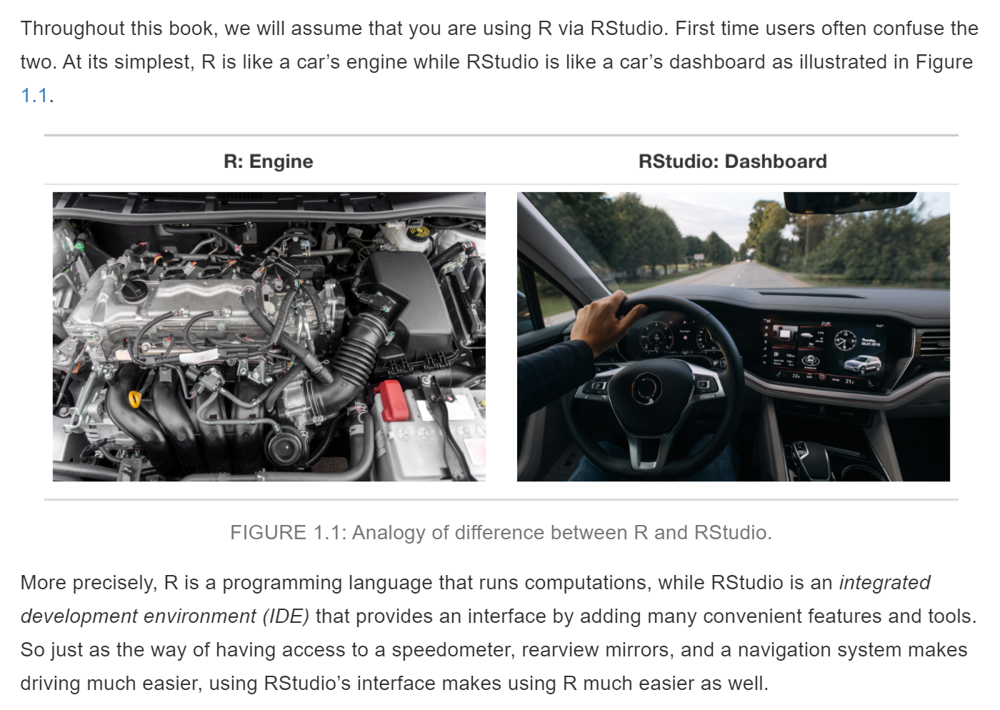

--- 
title: "COMM 3710: Getting Started with R"
author: |
        | Prof. Sara K. Yeo
        | Prof. Ye Sun
date: "`r Sys.Date()`"
site: bookdown::bookdown_site
documentclass: book
bibliography: [book.bib, packages.bib]
biblio-style: apalike
citation_package: biblatex
link-citations: yes
github-repo: openscapes/series
description: "A guide to getting started with R in COMM 3710."
---

# Introduction {#intro}

This is a guide for getting started and using R and RStudio in COMM 3710: Introduction to Quantitative Communication Research in the [Department of Communication](https://communication.utah.edu) at the [University of Utah](https://utah.edu).

----

## What is R?

> "R is a language and environment for statistical computing and graphics."^[https://www.r-project.org/about.html]

R is a free software environment for computing and graphics from [CRAN](https://cloud.r-project.org/), the Comprehensive R Archinve Network. You can always read more about R by visiting the homepage of the [R Project for Statistical Computing](https://www.r-project.org/) but you are probably more interested in the answer to the following question:

> What is R in the context of COMM 3710? 

In this course, you will learn to install and use R for data analysis. In other words, R is the software that you will use to complete your **individual lab assignments** and the data analysis components of your **group projects**.

---

## Why R?^[Adapted from [R vs. Excel: What's the Difference?](https://www.northeastern.edu/graduate/blog/r-vs-excel/)]

Increasingly, data are important components of decision-making. Whether you are looking at industry trends, generating financial statements and reports, analyzing market data, or creating visuals to communicate your work, you will need to know how to analyze data to efficiently, accurately, and professionally to develop reports and effectively communicate your findings. 

R is a tool that can help you do all this and more. This course will help you become familiar with this powerful data analysis tool. Often, students ask why we use R instead of Microsoft Excel in this course.

Here are some reasons for using R over Excel:

### Ease of Use

There is little doubt that Excel is much easier to use than R. Most of us already know many Excel basics and the learning curve is minimal compared to R. This is partly due to the point-and-click nature of Excel, allowing us to make simple charts and tables.

R, on the other hand, is a **programming language**. This means that the initial learning curve is, for most, likely to be steeper than that of Excel. However, with practice and time, R becomes easier quickly and you will soon realize that R is a powerful tool for analysis and generating visuals from data.

### Replicating Analysis

Having to use the point-and-click interface, or the graphical user interface (GUI), is a distinct disadvantage of Excel. Because you cannot import or use scripts, which are a collection of commands, **in Excel, you must rely on memory to replicate your analysis**.

R, on the other hand, is capable of reproducing analyses quickly and with different datasets. The commands for data analysis that you use in R can be saved as a script, which can then be run on multiple datasets. In other words, when we use R for data analysis, we do not have to "reinvent the (data analysis) wheel" as you would with Excel.

### Visualization

For simple graphics, Excel (with its minimal learning curve) can suffice. However, it is cumbersome to create attractive and professional-quality tables and figures in Excel.

Visualization is where R excels (HAH, see what I did there!). When datasets begin to get complicated or large, R is better equipped to handle them without making errors and can create impressive and easily customizable visual representations.

---

If you are still wondering why we are using R instead of Microsoft Excel for data analysis in this course, here are some examples that help illustrate the utility of R over Excel:

- [How the BBC Visual and Data Journalism team works with graphics in R](https://medium.com/bbc-visual-and-data-journalism/how-the-bbc-visual-and-data-journalism-team-works-with-graphics-in-r-ed0b35693535)
- [The Reinhart-Rogoff error - or How Not to Excel at Economics](https://theconversation.com/the-reinhart-rogoff-error-or-how-not-to-excel-at-economics-13646)

---

## R vs. RStudio

Figure \@ref(fig:R-vs-RStudio), from [ModernDive Chapter 1](https://moderndive.com/1-getting-started.html) is a good illustration of the distinction between R and RStudio [@ismayStatisticalInferenceData2021].

```{r R-vs-RStudio, fig.align = "center", fig.cap = "Analogy of the difference between R and RStudio. Source: [ModernDive Chapter 1](https://moderndive.com/1-getting-started.html).", echo = FALSE}

```

Throughout this course, you will be using R via [RStudio](https://www.rstudio.com). This means that you will need to have **both R and RStudio installed on your computer**. New users often confuse R and RStudio. The analogy makes it clear that one cannot be functional without the other. Just like the dashboard of a car would not be functional without the engine and vice versa, RStudio and R are not functional without each other.

Remember that R is a programming language for statistical computing and graphics. RStudio, on the other hand, is an *integrated development environment (IDE)* that provides an interface and adds convenient features. Just like your dashboard has an odometer, navigation system, etc., that makes driving easier, using RStudio’s interface makes statistical computing using R much easier.

Part of this [video](https://youtu.be/ZvPFKfNHBNQ) by Andy Field describes the difference between R and RStudio. This video will also show you how to install R and RStudio, which are covered in Chapter \@ref(install).

<!--chapter:end:index.Rmd-->


# Getting Started with R {#start}

Remember that you need both R and RStudio. Follow the instructions below to install both *programs* (also known as *applications*).

---

## Installing R {#install}

On a web browser, navigate to https://cloud.r-project.org/.

- If you are a Windows user: Click on “Download R for Windows”, then click on “base”, then click on the Download link.
- If you are macOS user: Click on “Download R for (Mac) OS X”, then under “Latest release:” click on R-X.X.X.pkg, where R-X.X.X is the version number. For example, the latest version of R as of February 14, 2021, is R-4.0.3.
- If you are a Linux user: Click on “Download R for Linux” and choose your distribution for more information on installing R for your setup.

---

## Installing RStudio

On a web browser, go to https://rstudio.com/products/rstudio/download/. Scroll down to **All Installers**. Download and install the version of RStudio that corresponds to your operating system. Update RStudio as necessary.

When you are ready to use R, you will open RStudio. In this course, you will rarely, if ever, need to use "base R." Figure \@ref(fig:open-R) shows you which icon to click on to open RStudio. Remember that you need to have both programs installed on your computer--one does not work without the other.

> From this point on, when "R" is referenced in the text, you know that you are accessing and using the language through RStudio.

```{r open-R, echo = FALSE, fig.cap = "Typically, you will only need to use RStudio for this course. Click the icon on the right to open RStudio. Source: [ModernDive](https://moderndive.com/1-getting-started.html#r-rstudio).", fig.align = "center"}
knitr::include_graphics("images/open-RStudio.png")
```

---

## How do I use R?

Unlike Excel, which has a point-and-click GUI, R is an [interpreted language](https://en.wikipedia.org/wiki/Interpreter_(computing)). This means that you, the user, must type in commands written in **R code**. In other words, this course will teach you to **code** or **program** using the R language.^[The terms *coding* and *programming* are used interchangeably in this book.]

In COMM 3710, we will learn R by "doing." You are responsible for your own learning--the best way to master R is to [practice deliberately](https://jamesclear.com/beginners-guide-deliberate-practice). 

> "While regular practice might include mindless repetitions, deliberate practice requires focused attention and is conducted with the specific goal of improving performance." [@clearBeginnerGuideDeliberate2017]

### A quick tour of RStudio {#tour}

Watch this [video](https://youtu.be/HWnanydsBCs) by Andy Field to take a quick tour of RStudio. 

As you have learned from Andy Field’s video, the RStudio interface consists of four panels (Figure \@ref(fig:RStudio-panels)).

> Wait! I only see 3 panels...

If you happen to see only three panels, please select *File > New File > R Script*. Your RStudio should like like Figure \@ref(fig:RStudio-panels).

```{r RStudio-panels, echo = FALSE, fig.cap = "Editor and Console windows in RStudio.", fig.align = "center"}
knitr::include_graphics("images/RStudio-panels.png")
```

### Some basic terminology and concepts {#terms}

Throughout the book, `R code` will be distinguished from text by using a different font. Let's start with some basic terms:

- **Console**: This is the panel in RStudio where you can view the output or results of your commands. Note that you can also enter commands in the Console panel. Pressing Enter after each command runs it, i.e., it tells R to execute the command.
- **Editor**: This is the panel in RStudio where you type commands in language that R understands. Think of this as a script containing instructions for R. You can save this script, which makes the work you have done reproducible.
- **R script**: A script is simply a text file containing a set of commands and comments. The script can be saved and used later to (re-)execute the saved commands. The script can also be edited so you can execute a modified version of the commands.
- **Objects**: Values in R are saved in objects.
- **Dataframes**: These are representations of datasets in R where the rows correspond to observations and the columns correspond to variables that describe the observations.
- **Logical operators**: These are operators in R that represent "and" (`&`) and "or" (`|`).
- **Functions**: Functions are also known as **commands**. Functions and commands tell R what you want it to do. Functions take the form of `command()` with parentheses (or parents). The parentheses are for **arguments**, which give R specifics about the function you want it to perform.

### Errors, warnings, and messages

R shows errors, warnings, and messages in the Console window. Typically, it does so in <span style="color: red;">red</span> font, which can be intimidating for new users. **DO NOT WORRY--YOU ARE UNLIKELY TO "BREAK" R**.

> Always read errors, warnings, or messages carefully; they often provide information that will help you troubleshoot the issue.

### Tips for learning to code {#learning-tips}

Learning to code can be frustrating at first. Frustrations are understandable and inevitable. But with [deliberate practice](https://jamesclear.com/beginners-guide-deliberate-practice), your coding and programming skills will improve.

Keep the following tips from Ismay and Kim [-@ismayStatisticalInferenceData2021] in mind as you learn to code in R:

- **Computers are not that smart.** You are the brains of the computer--it needs to be told what to do. Instructions must be clear and without ambuguity.
- **Copy, paste, tweak.** When you begin to learn coding, it is much easier to copy, paste, and modify code than start from scratch. When you first start to program, take existing code from the resources for this course, copy, paste, and tweak them to suit your goals. Once you become more comfortable with R, you will be able to recall functions and code from memory.
- **Learning by doing.** The best way to learn coding/programming is by doing. This is why COMM 3710 includes a lab component. Individual lab assignments and group project components afford you the opportunity to learn how to code and use R by completing tasks with a goal in mind.
- **Practice, practice, practice.** As with any skill, practice is necessary for improvement. Start on assignments early--anticipate that you will face challenges the first time you try an assignment. Use the resources provided in the course to help you troubleshoot. Most students **do not** start their assignments early enough to troubleshoot issues that arise. You can also use R for other courses--it is a versatile programming language that is powerful once you learn to use it. In fact, this book was made with R!
- **R is case-sensitive.** Most coding mistakes are typos. This is exacerbated when the programming language, such as R, is case-sensitive. `Result`, `result`, and `RESULT` are all different in R!

### R packages {#packages}

There is a worldwide community of R users (e.g., search for #RCatLadies on [Twitter](https://www.twitter.com)) who write code and bundle them into packages to extend the functionality of R. 

Some examples that we will use in this course include `ggplot2` [@wickhamGgplot2ElegantGraphics2020], `descr`, and `tidyverse`.

Packages in R are like apps on your phone--they extend the functionality of the base technology (Figure \@ref(fig:packages)).

```{r packages, echo = FALSE, fig.cap = "R packages are to R what apps are to your mobile phone.", fig.align = "center"}
knitr::include_graphics("images/packages.png")
```

There are two steps to using apps to extend the functionality of your phone:

1) **Install app on your device from app store.** This is typically done only once. An app that has been installed on your phone does not require additional installation.
2) **Open app from device.** You must open the app every time you wish to use it.  

Similarly, R packages need to be **installed** on your computer and then opened and then **loaded** in R (Figure \@ref(fig:install-load-packages)). Note where quotation marks are used and omitted in the commands.

```{r install-load-packages, echo = FALSE, fig.cap = "Watch this gif to learn how to install and load packages in R. Note that the commands are typed into the Editor, not the Console--to run the commands written in the Editor, highlight and click *Run* in the top right corner.", fig.align = "center"}
knitr:: include_graphics("images/install-load-packages.gif")
```

1) **To install a package**, type `install.packages()` in the Console window. The argument that needs to be provided is the name of the package. For example, if you are installing the `descr` package, you would use the command `install.packages("descr")`. Like an app, you only need to install a package once.
2) **To use a package**, you must load it. This is like opening an app--it must be done everytime you open a new R session. To load a package, use the command `library()`. The argument within the parentheses is the name of the package you want to load. For example, to load the `descr` package, use `library(descr)`.

Some *common errors related to installing and loading packages,* which R displays in <span style="color: red;">red</span> in the Console, are shown below:

```
Error in library(descr) : there is no package called ‘descr’
```

If you get this error, this means that you have not installed the package.

```
Error: could not find function
```

This error means that you likely did not load the package for this R session. Remember, you need to load R packages each time you open R.

---

## Learning by doing

Let's try out some commands. Open RStudio and start a new R script. If you need a reminder of how to start a new R script, review section \@ref(tour). To save your R script, see Section \@ref(saveRscript)

To start, let's execute a simple command. In the **Editor**, type the following command. Note that in this text, commands in R are preceded by `>`.
```{r eval = FALSE, prompt=TRUE}
4 + 8
```

To run this command, which tells R to sum 4 and 8, highlight the command and click the  button in the upper right of the Editor window. You can also use the shortcut keys: Ctrl + Enter (Windows) or Cmd + Enter (Mac).

You will see the result of the command you just ran in the **Console** window.

```{r echo = FALSE}
4 + 8
```

Note that the `[1]` is produced by R. You can think of this as R telling you that this value, `12`, is the answer to the first question you asked.^[This is not exactly accurate, but it is close enough for now.]

Next, try:

```{r eval = FALSE, prompt=TRUE}
3 * 3
```

When you run this command, R will return the product of these two numbers.

```{r echo = FALSE}
3 * 3
```

Although it is good practice to write and execute commands line-by-line when you are first writing a R script, it can  become tedious. To alleviate the tedium, you can run multiple commands at once by selecting all the lines that you want R to execute and using the keyboard shortcuts or the  button.

Type the following two lines in your Editor and try running them together: 

```{r eval = FALSE, prompt=TRUE}
12 + 8
16 / 4
```

The results in your Console panel should look like this:

```{r echo = FALSE}
12 + 8
16 / 4
```

Table \@ref(tab:basic-ops) shows some basic arithmetic operations in R. Play around with these functions in R to familiarize yourself with the R interface.

```{r basic-ops, echo = FALSE}
df <- dplyr::tibble(Operation = c("addition/sum", "subtraction", "multiplication/product", "division", "power/exponent"),
                    Operator = c("+", "-", "*", "/", "^"),
                    Input = c("2 + 2", "9 - 2", "5 * 5", "12 / 3", "5 ^ 2"),
                    Output = c(4, 7, 25, 4, 25))
knitr::kable(
  df, booktabs = TRUE,
  caption = "Operations, operators, and example inputs and outputs in R."
)
```

### Creating objects

R is an [**OOP** or **object-oriented programming**](https://en.wikipedia.org/wiki/Object-oriented_programming) language. 

You can think of an **object** as a container that holds information that you, the user, assigns to it. You will need to assign a label to the container. R stores the information within the labeled container in the **Environment** (Figure \@ref(fig:environment)), which is the one of the tabs in the top right panel of RStudio.

```{r environment, echo = FALSE, fig.cap = "The Environment panel in RStudio.", fig.align = "center"}
knitr::include_graphics("images/environment.png")
```

We assign information to an object by using the **assignment operator**, `<-`. The generic code for creating an object looks like:

```
label <- information
```

Let's say that we want to save the result of `2 * 10` to an object and call it `kittens`. In the **Editor** window, type and run the following R code:

```{r, prompt=TRUE}
kittens <- 2 * 10
```

Notice that the result in the **Console** when you ran this command did not give you the result of `2 * 10`.

This is because the result is stored as the object, `kittens`, and you have to ask R to display the result by calling the object. In the Editor, type `kittens` and run this command. You should see the result in the Console.

```{r, prompt=TRUE}
kittens
```

Notice that the object, `kittens`, appeared in the **Environment** when you ran the command, `kittens <- 2 * 10` (Figure \@ref(fig:kittens-env)).

```{r kittens-env, echo = FALSE, out.width = "80%", fig.align="center", fig.cap="The Environment panel after you run the R code to create the object, `kittens`."}
knitr::include_graphics("images/kittens-env.png")
```

### Data types

R can store objects with different types of data. Let's create three objects containing different data types.

```{r, prompt=TRUE}
a <- 19.81
b <- "Hello, Salt Lake City!"
c <- TRUE
```

To check the type of data contained in objects `a`, `b`, and `c`, use the `class()` function.

```{r eval = FALSE, prompt=TRUE}
class(a)
class(b)
class(c)
```

Your Console should show:

```{r echo = FALSE}
class(a)
class(b)
class(c)
```

`a` is numeric; `b` is a character string; `c` is a so-called "logical" data type that is either `TRUE` or `FALSE`. These data types can be organized into various data structures. For example, a data frame, such as the data files you will use in your assignments, is one data structure.

### R Functions

As mentioned in Section \@ref(terms), functions are commands that tell R what you want it to do. Functions take the (generic) form of `command()` with parentheses (or parents). The parentheses are for **arguments**, which give R specifics about the function you want it to perform.

For example, the `print()` function will print the result of the argument or input within the parentheses.

```{r, prompt=TRUE}
print("Hello, SLC!")
print(5 * 10)
print(3 > 5)
```

### Working with data frames

Let's create a data frame to learn how to work with them. In the **Editor** panel, create a data frame by typing the following commands:

```{r, prompt=TRUE}
id <- 1:7
cats <- c(1, 3, 2, 3, 5, 2, 3)
gender <- c('male', 'female', 'male', 'female', 'male', 'female', 'female')
```

With the code above, you have created 3 objects, `id`, `cats`, and `gender`, using the `concatenate()` function, which can be shortened to `c()`. Assume these data represent 7 individuals who own a varying number of `cats`. And we have data on each individual's `gender`.

Let's create a data frame from these individual objects.

```{r, prompt=TRUE}
mydata <- data.frame(id, gender, cats)
View(mydata)
```

After running the commands above, notice that your **Environment** panel now looks like Figure \@ref(fig:cat-env). Your data frame should look like Figure \@ref(fig:dataframe).

```{r cat-env, echo=FALSE, out.width="80%", fig.cap="Your Environment panel should look like this once you have run the above code.", fig.align="center"}
knitr::include_graphics("images/cat-env.png")
```

```{r dataframe, echo=FALSE, out.width="30%", fig.cap="The data frame you just created.", fig.align="center"}
knitr::include_graphics("images/cat-data.png")
```

Using the `mydata` data frame, we will calculate the mean number of cats an individual in our data set owns.

```{r, prompt = TRUE}
mean(mydata$cats)
```

The `$` allows us to extract a column of data, or a **variable**, from the `mydata` data frame. The use of `$` will be important when working with R throughout this course.

To see how many females vs. males are included in the data frame, use the following command.

```{r, prompt = TRUE}
table(mydata$gender)
```

Let's now look at only the number of cats owned by males in our data. This means we need to **subset** the data. To do so, we use square brackets, `[]` combined with logical operators. In this case, we will use the logical operator, `==`, which means "equal to."

```{r, prompt=TRUE}
mydata$cats[mydata$gender == "male"]
```

To calculate the mean number of cats owned by males, we can either create a second data frame that is the subset of `mydata`...

```{r, prompt=TRUE}
Monly <- subset(mydata, gender == "male")
mean(Monly$cats) ## in this case, we must use the column, cats, in the data frame that has been subsetted, Monly.
```

or we can include the last command as an argument in the `mean()` function.

```{r, prompt=TRUE}
mean(mydata$cats[mydata$gender == "male"])
```

### Logical operators

We used one possible logical operator, `==`, in the example above. Other logical operators include:

* `<`: less than
* `<=`: less than or equal to 
* `>`: greater than
* `>=`: greater than or equal to
* `!=`: not equal to
* `==`: equal to
* `&`: and (e.g., `a & b` means "a AND b")
* `|`: or (e.g., `a | b ` means "a OR b")

We can also use `!` to specify a condition as **not** something. Returning to our example of the mean number of cats males in `mydata` own, we could instead calculate the mean of cats owned by all individuals who are `!= "female"` or "not female."

```{r}
mean(mydata$cats[mydata$gender != "female"])
```

Figure \@ref(fig:boolean) is a visual representation of the differences between some logical operators.

```{r boolean, echo=FALSE, fig.cap="Differences between AND, OR, and NOT.", fig.align="center"}
knitr::include_graphics("https://s3.amazonaws.com/libapps/accounts/7346/images/Boolean-Ven.jpg")
```

<!--chapter:end:01_get-started.Rmd-->

# Setting Up R for Assignments {#setup}

In this course you will use R for individual lab assignments and group project components. This chapter walks you through setting up R in preparation for completing assignments. Although you may have to refer to this chapter the first few times you set up R, you will soon become accustomed to the process and it will be a natural part of your workflow.

---

## Open RStudio

Remember that R is the engine while RStudio is your dashboard. When you head out in a car, you don't start by tinkering with the engine. Instead, you use the car via its dashboard.

Similarly, we will interact and use R through RStudio.

---

## Create a new R script

To start a new R script, use the *File* menu or the shortcut keys Ctrl + Shift + N (Windows) or Cmd + Shift + N (Mac).^[Keyboard shortcuts are available under *Tools* $\rightarrow$ *Keyboard Shortcuts Help*.]

```{r new-script, echo = FALSE, fig.cap = "Open a new R script in RStudio.", fig.align = "center"}
knitr:: include_graphics("images/new-R-script.gif")
```

---

## Prepare R script

To prepare your R script, use comments to type any relevant information about the script. Examples of relevant information include your name, your course, the semester during which you are enrolled in this course, the assignment name.

Comments in R are denoted by the hashtag symbol, `#`.

```{r}
## This is a comment.
```

Once you have included information about your script as comments, you should **set your working directory** (Figure \@ref(fig:wd)). You can use the command `setwd()` to do this or the shortcut keys: Ctrl + Shift + H (Windows/Mac).

```{r wd, echo = FALSE, fig.cap="Set your working directory in RStudio using the function, `setwd()`.", fig.align="center"}
knitr::include_graphics("images/set-working-dir.gif")
```

---

## Install and load packages

Next, you need to install and load the R packages (see \@ref(packages)) you will be using for this R session. Refer to section \@ref(packages) for the commands for installing and loading packages.

---

## Saving your R script {#saveRscript}

**Be sure to save your work often.**

You are likely familiar with file types like *.docx* (Word documents), *.pdf* (PDF documents), and *.txt* (text files). If you have not worked with R prior to enrolling in this course, you may not have encountered files with the extension **.R**.

Files with a .R extension are known as **R scripts**. As noted in Section \@ref(tour), a R script is simply a text file containing a set of commands and comments.

To save your script, click the  icon in RStudio or use the *File* menu (Figure \@ref(fig:fig-save)). Give the file a sensible name and click *Save*. The file will be saved as <filename>.R in your working directory.

```{r fig-save, echo=FALSE, fig.cap="Saving your R script in RStudio.", fig.align='center'}
knitr::include_graphics("images/saving-R-script.gif")
```

---

## Compiling your R script into a PDF

Most of your assignments will require you to submit a PDF document in addition to your R script. There are two main ways to create a PDF document for your assignments:

1) Open a Microsoft Word document and copy and paste the necessary text into that document while you work. Remember to save often. Once you have completed the assignment, save the Word document as a PDF document.
2) Have R compile your script into a PDF document. You can do this through the GUI by clicking on *File* $\rightarrow$ *Knit Document*. When the dialog box appears, select *PDF* as the *Report output format* and click *Compile* (Figure \@ref(fig:compile)).

```{r compile, echo=FALSE, fig.align='center', fig.cap="Compiling a PDF from your R script in RStudio."}
knitr::include_graphics("images/compile-pdf.gif")
```


<!--chapter:end:02_setup.Rmd-->

# Tips on Working with R {#tips}

This chapter contains a collection of tips to help you progress on your R learning journey. Remember that there are many ways to achieve a goal using R code and there is a large community of R users who are often willing and able to help with troubleshooting code (e.g., [Stack Overflow](https://stackoverflow.com/questions/tagged/r), [RStudio Community](https://community.rstudio.com/)).

---

## On labeling and naming objects

1. **R is case-sensitive**. We covered this in Section \@ref(learning-tips) but it is important enough to repeat. `CATS`, `cats`, `Cats`, `cAts`, and `caTs` are all different objects in R (Figure \@ref(fig:cats))!

```{r cats, echo=FALSE, fig.align='center', fig.cap="All the cats. This image is from Aoshima Island, Japan. Read more about Aoshima Island [here](https://www.theatlantic.com/photo/2015/03/a-visit-to-aoshima-a-cat-island-in-japan/386647/)."}

```

2. **Object names cannot include spaces.** Therefore, `my result` is not a valid name, but `my.result` or `my_result` will work. You can also use numbers in object names.

3. **Short, informative labels for objects are best.** Obviously, there is some trade-off between labels that are informative (tend to be long) vs. those that are short (tend not to be specific). Use your own judgment and common sense when naming objects. Read more about R coding style in [the tidyverse style guide's Chapters 1 and 2](https://style.tidyverse.org/).

---

## On script annotation

When writing R code, you should include explanations to your future self or to other team members (e.g., when conducting data analysis for your group project). These explanations can be included as comments and annotations to your R code in the script.

Comments in R begin with `#`. R recognizes text that follows `#` as comments and ignores that text when running the code. Include annotations wherever possible; your future self and team members will thank you later.

Below is an example of some code that includes annotations and comments. Note that you can use as many `#` as you want.

```{r, echo=TRUE, eval=FALSE}
## Start by defining an object
x <- 3+5

y <- x+6 # adding 2 to x and assigning the result to y for later use

z <- x*y # z is the product of x and y

print(z) # this function displays the result of z in the Console

## Next, I want to determine the mean across x, y, and z
xyz <- c(x, y, z) # this combines x, y, and z
print(xyz)

mean(xyz) # this line calculates the mean of the object, xyz

###############################################################################
```

When you run this script, R recognizes the commands and ignores the comments. However, the comments and annotations are saved in the R script--and your future self and the rest of your team will be grateful.

```{r, prompt=TRUE, echo=FALSE}
## Start by defining an object
x <- 3+5

y <- x+6 # adding 2 to x and assigning the result to y for later use

z <- x*y # z is the product of x and y

print(z) # this function displays the result of z in the Console

## Next, I want to determine the mean across x, y, and z
xyz <- c(x, y, z) # this combines x, y, and z
print(xyz)

mean(xyz) # this line calculates the mean of the object, xyz
```

---

## Be patient^[Source: @barrettDataScienceAtomic2021]

> “Whenever you’re learning a new tool, for a long time, you’re going to suck… But the good news is that is typical; that’s something that happens to everyone, and it’s only temporary.” -*Hadley Wickham*

The benefits of learning by doing slowly build and compound over time. This means that one *must invest time to learn R by doing*. You can expect the learning curve to look something like this:

```{r mastering-R, echo=FALSE, fig.align='center'}
library(ggplot2)
inner_thoughts <- tibble::tribble(
  ~x,  ~y,    ~label,
  0,   800,   "Cool!",
  0.9, 800,   "...?",
  1.8, 1400,  "object... of\ntype... closure?",
  3.9, 900,   "Ugghhhh",
  5.3, 1200,  "Ugghhhhhh",
  6.7, 2500,  "Oh wait",
  7.7, 4000,  "...!!",
  8.5, 8000,  "!!!!!",
  7.9, 20000, "Oh sure, it's easy"
)

ggplot() + 
  geom_function(fun = exp, size = 1.2, color = "firebrick") + 
  geom_text(data = inner_thoughts, aes(x, y, label = label), hjust = 0) +
  xlim(0, 10) + 
  ggtitle("Mastering a programming language") + 
  theme_void(24)
```

Expect to ride the R rollercoaster (Figure \@ref(fig:r-coaster)).

```{r r-coaster, echo=FALSE, fig.align='center', fig.cap="The R rollercoaster. Artwork by [Allison Horst](https://twitter.com/allison_horst)."}
knitr::include_graphics("images/r_rollercoaster.png")
```

The following paragraph is an excerpt from Barrett's [-@barrettDataScienceAtomic2021] blog post. The [original post](https://malco.io/2021/01/04/data-science-as-an-atomic-habit/) is worth reading and keeping in mind as you take this learning journey of R and, more broadly, data science.

> This is the stubbornly quiet path of practice: our abilities lag behind our effort. At the 'Ugghhhh' stage, our internal motivation starts to dissolve. Sure, you can make a plot or whatever, but you're still fighting errors all day. What do you have to show for it at this point? Not that much more, you might feel, than when you started. But our growth is rarely linear: often, it’s explosive, at least at critical moments. We suddenly begin to make connections, which help us build other relationships, and so on. Growth is never infinite, but it’s also rarely as linked to our immediate efforts as we expect.

<!--chapter:end:03_tips.Rmd-->

# Graphing with `ggplot2` {#ggplot2}

This chapter covers the basics of plotting with the package, `ggplot2`. This package is contained within a collection of R packages designed for data science known as the [tidyverse](https://www.tidyverse.org/).

The core tidyverse includes packages that we use in everyday data analysis, including:

- `ggplot2`
- `dplyr`
- `tibble`

To learn more about the tidyverse, visit [tidyverse.org](https://www.tidyverse.org/).

To start working with graphs, first install and load the required package. Remember that you only have to install the package once (see Section \@ref(packages) to review R packages). 
```{r, eval=FALSE, prompt=TRUE}
install.packages("tidyverse") # you may not need this command
library(tidyverse)
```

```{r include = FALSE}
library(tidyverse) 
```

---

## `ggplot2` basics 

Building `ggplot` graphics is typically a layered process. The function that we use is `ggplot()`. We use the `+` to add layers to the function.

In the function arguments (i.e., the commands within the parentheses), we define the data set that we want to use with `data = `, the aesthetics (x- and y-axes) with `aes()`, and the type of graph with `geom`.

In the steps below, we will build the command sequentially. The `ggplot()` function will not run until the basic layers are in place. 

### Step 1. Specify data frame

Use the `data = ` argument to specify the data frame you are using to build the plot. Note that the word "data" in `(data = )` is an argument and should not be replaced. For example, if your data frame is named `utilities`, this line will be `ggplot(data = utilities)`.
``` {r, eval = FALSE, prompt=TRUE}
ggplot(data = dataframe_name) 
```

### Step 2. Specify x- and y-axes

Next, use `aes()` to tell R which variable to place on the x- (`x_var`) and y-axes (`y_var`). Note that you are adding this argument within the parentheses of the function, `ggplot()`. Be sure to close all parentheses--not doing so is a common error in R.
``` {r, eval = FALSE, prompt=TRUE}
ggplot(data = dataframe_name, aes(x = x_var, y = y_var))
```

If you are only working with only one variable (e.g., plotting a histogram of one variable), you need only specify the `x = ` variable within `aes()`.

### Step 3. Add geom

The third step is to tell R what type of graph to create--points, lines, bars, histograms, etc.--by adding the `geom` layer. This function is layered on to the `ggplot()` function  using the `+` sign.

For example, if we would like the relationship between two variables to be represented by a scatter plot, we can simply add `geom_point()`. 
``` {r eval = FALSE, prompt=TRUE}
ggplot(data = dataframe_name, aes(x = x_var, y = y_var)) + # note the + sign
         geom_point()
```

If we are plotting the histogram of one variable, we use `geom_histogram()`. 
``` {r eval = FALSE, prompt=TRUE}
ggplot(data = dataframe_name, aes(x = x_var)) + # note the + sign again
         geom_histogram()

## This is slightly different than the exact commands used in the video but
## more intuitive following the logic in this guide.
```

For a bar plot, we use `geom_bar()`.
``` {r eval = FALSE, prompt=TRUE}
ggplot(data = dataframe_name, aes(x = x_var)) + # note the + sign yet again
         geom_bar()
```

---

## Important considerations

The `+` sign used to add layers **must** be placed at the end of each line containing a layer. If the `+` sign is added in the line before the other layer, `ggplot2` will return an error message.
``` {r eval = FALSE, prompt=TRUE}
# This is the correct way of adding layers
ggplot( .... ) +
        geom_point()

# This will give you an error message
ggplot( .... ) 
       + geom_point()
```

```{r include = FALSE}
id <- 1: 120
quiz1 <- round(rnorm(120, m = 8.4, sd = .5), digits = 1)
quiz2 <- round(quiz1*0.9 + 0.3 + rnorm(120, m = 0, sd = .3), digits = 1)
quiz <- data.frame(id, quiz1, quiz2)

write.csv(quiz, file = "quiz.csv")
```

---

## Learning by doing

Let's create a graph with a fake data set ["quiz.csv"](http://sarakyeo.github.io/COMM-3710-bookdown/quiz.csv). It contains simulated data for Quiz 1 and 2 scores of 120 students. There data set contains three variables: 

- `id`: Student ID
- `quiz1`: Quiz 1 scores
- `quiz2`: Quiz 2 scores

First, make sure you set the working directory correctly on your computer and load the packages. 

Download this [data set](http://sarakyeo.github.io/COMM-3710-bookdown/quiz.csv) and read it into R.
```{r prompt=TRUE}
quiz <- read.csv("quiz.csv")
```

### Histograms
Let us examine the distribution of grades for Quiz 1 using a histogram.  

To better understand what R is doing step-by-step, run these lines one at a time and see what happens in the **Plots** panel in RStudio. 
```{r eval=FALSE, prompt=TRUE}
# 1: Try this command first
ggplot(data = quiz)
# 2: Then try this one
ggplot(data = quiz, aes(x = quiz1))
# 3: And, finally, try this
ggplot(data = quiz, aes(x = quiz1)) +
  geom_histogram()
```

As the exercise shows, the complete command is the third one. 
```{r prompt=TRUE}
ggplot(data = quiz, aes(x = quiz1)) +
  geom_histogram()
```

To do the same for Quiz 2 grades, simply change the x-axis specification in `aes()`.
```{r prompt=TRUE}
ggplot(data = quiz, aes(x = quiz2)) +
  geom_histogram()
```

### Scatter plots

What if we want to examine whether there is a relationship between Quiz 1 and Quiz 2 scores? You might hypothesize that the scores on Quizzes 1 and 2 should be positively correlated.

To examine this graphically, we can use a **scatter plot**, which depicts the relationship between two quantitative variables. In this case, we use `geom_point()` to tell R that we want a graph with points.

```{r prompt=TRUE}
ggplot(data = quiz, aes(x = quiz1, y = quiz2)) +
  geom_point() 
```

### Adding axes labels and plot titles

No graph is complete without axis labels and a title. We can add axis labels and a plot title with the `labs()` layer. Again, it is important to add this layer by using the `+` sign.

```{r prompt=TRUE}
ggplot(data = quiz, aes(x = quiz1, y = quiz2)) +
  geom_point() + 
  labs(x = 'Quiz 1 Grades', 
       y = 'Quiz 2 Grades',
       title = 'Relationship between Quiz 1 and Quiz 2 grades in COMM 3710')
```

---

## Additional resources for graphing

This guide includes only the basics of graphing with `ggplot2`. If you have questions that are not covered in this guide, the [R Graphics Cookbook](https://r-graphics.org/index.html) is a practical guide that provides recipes for quickly generating high-quality graphs.


<!--chapter:end:04_ggplot2.Rmd-->

`r if (knitr::is_html_output()) '# References {-}'`

<!--chapter:end:references.Rmd-->

