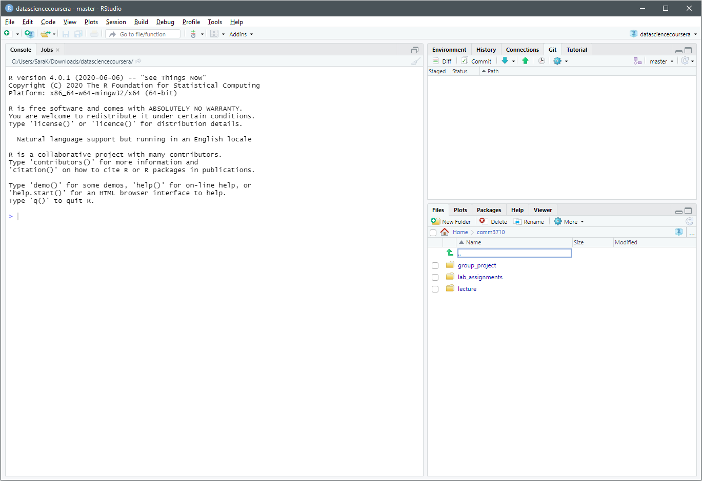
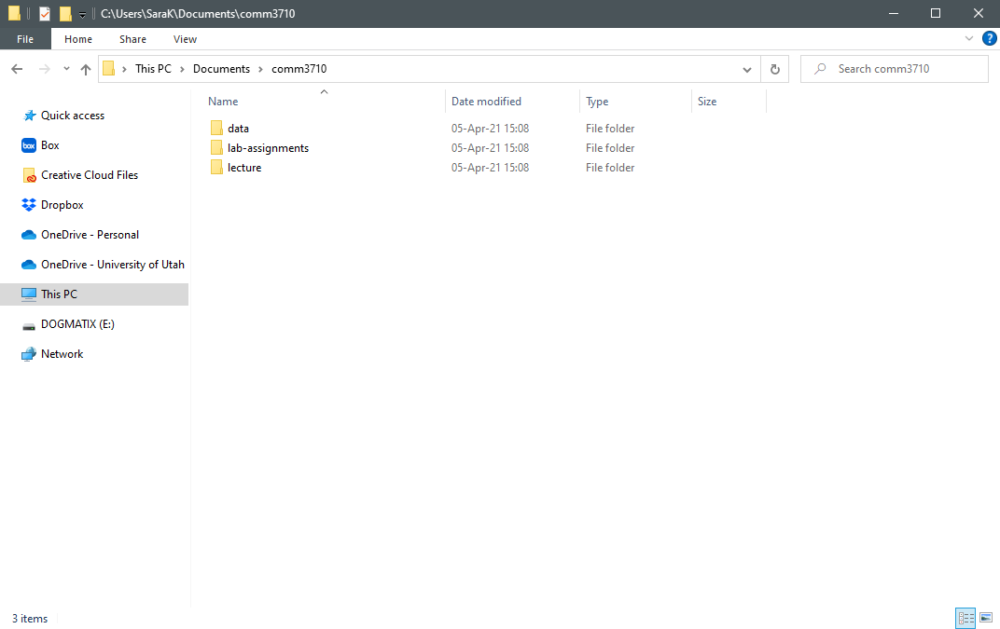
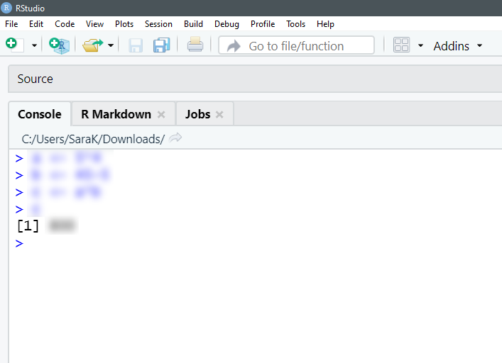

[R](https://cran.r-project.org/) is the programming language and environment that we will be using for statistical analysis. It is open-source. For more information on R, you can visit the [R Project for Statistical Computing](https://www.r-project.org/).

[RStudio](https://rstudio.com/) is the program through which we will be using R. You will need to download and install both R and RStudio.

**This assignment has two (2) parts.** In general, you should read the assignment in its entirety before starting.

---

# Part I: Installation and Set Up
## Step 1
Watch this [video](https://youtu.be/ZvPFKfNHBNQ) explaining R and RStudio and how to install both pieces of software.

## Step 2
Read Ch. 1 of [COMM 3710: Getting Started with R](https://sarakyeo.github.io/COMM-3710-bookdown/docs/index.html).

## Step 3
Follow the instructions in [Sections 2.1 and 2.2](https://sarakyeo.github.io/COMM-3710-bookdown/docs/start.html#install) to install R and RStudio. Then, watch this [video](https://rstudio.com/products/rstudio/?wvideo=520zbd3tij) to learn how to navigate RStudio. **Take a screenshot of RStudio**.

## Step 4
Set preferences in RStudio.

- Open RStudio. Click on `Tools` and navigate to `Global Options...`.
- Uncheck the box next to `Restore .RData into workspace at startup`.
- Where it says `Save workspace to .RData on exit:`, select `Never`.
- Click `Apply` and `OK` to exit.

These settings ensure that R does not carry forward objects (such as data) that you were working on in a prior assignment to a new assignment.

> Make a habit of *completely* shutting down RStudio when you are done working. This will clear the "Environment," which is a good thing.

## Step 5
Create a working directory for COMM 3710. This can be anywhere on your computer that you choose, you just need to know where it is (e.g., in your Documents folder).

## Step 6
Organize your working directory.

A working directory is a computer folder that contains all your materials related to a project (e.g., this course). Using a consistent folder structure across your projects will help keep things organized, and will also make it easy to find/file things in the future. This can be especially helpful when you have multiple projects. In general, you may create directories (folders) for **scripts**, **data**, and **documents**.

Choose a naming convention for your class folder and stick with it. Some recommendations (*Note: While the options below look similar, R is case-sensitive, i.e., the folder names below are not the same!*):

- COMM3710
- comm3710
- comm_3710
- Comm3710

- Create three (3) subfolders in your working directory:

1. `lecture` to store notes and documents related to lecture content.
2. `lab_assignments` to store your lab assignments.
3. `data` for storing data files.

**All files related to this course should be stored in this working directory. Take a screenshot of your working directory.**

---

# Part II: Get Started with R
## Step 1
Read [Sections 2.3 and 2.4 in COMM 3710: Getting Started with R](https://sarakyeo.github.io/COMM-3710-bookdown/docs/start.html#how-do-i-use-r). Then, follow the instructions below and answer the questions.

## Step 2
a) Create an object that represents the product of `10 x 2`, and assign a name of your choice to this object.
b) Create a second object that represents the outcome of `35 - 5`, and assign a name of your choice to this object.
c) Create a third object that represents the *product* of the first two objects and assign a name of your choice to this object.
d) Answer the following question: What is the value of the third object?

**Submit a screenshot of the R commands that you used to arrive at your answer to Question 4. This screenshot should include all three objects from Questions 1-3 and the answer to Question 4.**

---

# Submission 
Submit a **single PDF document** on Canvas. Your PDF submission should contain the three (3) screenshots.

1. RStudio screenshot (see example below).
2. COMM 3710 working directory screenshot (see example below).
3. Screenshot of your R commands.

---

## Sample screenshots {.tabset .tabset-fade}
### RStudio

### COMM 3710 working directory

### Example screenshot for Part II

