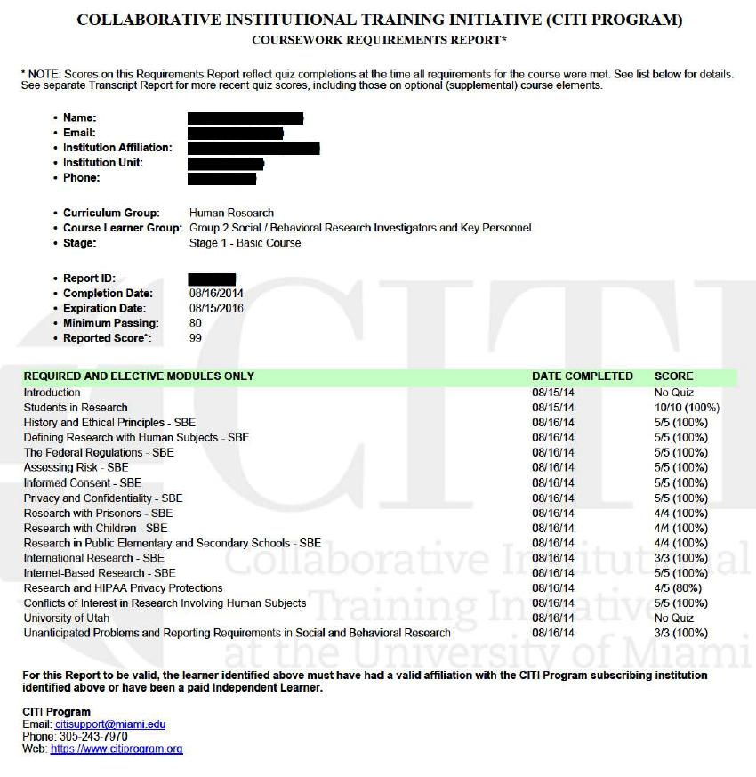

# Instructions

For this assignment, you will complete online training modules on ethical conduct of human subjects research through the Collaborative Institutional Training Initiative (CITI).

**Read the instructions carefully and in their entirety before starting.**

To complete CITI training, follow the instructions below:

1.  Open your browser and navigate to [https://www.citiprogram.org](https://www.citiprogram.org/). Click `Register`.

2.  Click on `Select Your Organization Affiliation`. Enter "University of Utah" in the space provided. Agree to the terms of service, etc. and affirm that you are affiliated with the University of Utah. Click `Create a CITI Program account`.

3.  Fill in your **first and last name** and your **utah.edu email address** in the appropriate fields. Click `Continue to Step 3`. You may add your personal email address as a secondary email address.

4.  Create a username and password. Fill in the required fields. When asked to verify your email address, be sure to check your Spam folder for the verification email.

5.  When you are asked `Are you interested in the option of receiving Continuing Education Unit credit for completed CITI Program courses?` Select `No`. Remember to answer the required question at the bottom of the page about participation in research surveys.

6.  Under `Department`, type "Communication." From the drop-down menu of `What is your role in research?`, select `Student researcher – Undergraduate`.

7.  Next, select `Group 2: Social/Behavioral Research Investigators and Key Personnel`.

8.  On the next screen, **if you have not completed the basic Social/Behavioral Research course**, select `I have not previously completed an approved Basic Course`. If you have completed a basic course, then complete the Refresher course.

9.  On the `Optional Courses` screen, select `Not at this time`. You are, of course, welcome to take additional courses, but only the `Group 2: Social/Behavioral Research Investigators and Key Personnel` course is required for this assignment.

10. Click `Finalize registration` to complete your registration. If you do not see the Group 2 course on the next screen, click `University of Utah Courses` to expand the tab. Click on the Group 2 link to start the training.

11. Complete all modules in the Group 2: Social/Behavioral Research Investigators and Key Personnel course **with a grade of at least 80%**.

12. Once you have completed the modules, click `View / Print Report`. **Save the resulting report as a PDF file**. Note that you want the **report** and not the **certificate**.

------------------------------------------------------------------------

# Submission

Submit the report (not certificate) as a **PDF file** on Canvas. An example submission is shown below.

------------------------------------------------------------------------

# Example CITI Report

{width=6.5in fig-align="center"}

<!--Lab Lesson Plan

# 1) Take attendance

# 2) Discuss course details

## Lecture
Quizzes
- Reminder: Quizzes open on Tuesdays and close on Sundays. You have 20 min to complete quizzes.
- Do not wait until the weekend to complete the quiz. For example, if they have technical issues, neither we nor CTLE can help them on Friday evenings or Saturdays.

## Lab
Assignments
- There will be 9 lab assignments.
- You will have two weeks to complete each assignment.

# 3) Discuss research ethics
- Discussion, no slides.
- Most egregious breaches of research ethics have been turned in to movies.
	- *The Stanford Prison Experiment* (2015)
	- *The Immortal Life of Henrietta Lacks* (2017)
	- *Experimenter* (2015)
- Belmont report-sets out the standards for ethical research.
	1) **Respect for persons**
		- Has to do with autonomous choice, informed consent.
		- Participants must be aware of what is being asked of them.
	2) **Beneficience**
		- Maximize benefits and minimize risks
		- Better society
	3) **Justice**
		- Risks and benefits fairly distributed.
		- Cannot coerce into participating.
		- e.g., prisoners, children

# 4) Introduce LA-1
- Introduce LA-1.
- Materials are on Canvas.
- Please ask questions.
- Remember all assignments are to be completed individually.
- Students who have completed CITI training in a previous semester or different course should take the Refresher Course.
- Let students work on LA-1 for the remainder of class.

-->