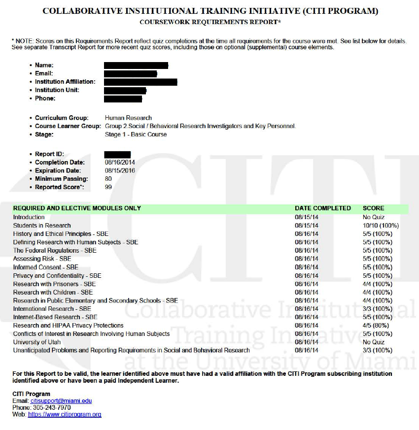

# Instructions

For this assignment, you will complete online training modules on ethical conduct of human subjects research through the Collaborative Institutional Training Initiative (CITI).

To complete CITI training, follow the instructions below:

1. Open your browser and navigate to [https://www.citiprogram.org](https://www.citiprogram.org/). Click `Register`.

2. Enter your university affiliation. Click `Continue to Step 2`.

3. Fill in your **first and last names** and your **utah.edu email address**. Click `Continue to Step 3`.

4. Create a username and password. Fill in the required fields. When asked to verify your email address, be sure to check your Spam folder for the verification email.

5. When you are asked "Are you interested in the option of receiving Continuing Education Unit credit for completed CITI Program courses?" Select `No`. Remember to answer the required question at the bottom of the page about participation in research surveys.

6. Under `Department`, type "Communication." From the drop-down menu of `What is your role in research?`, select `Student researcher – Undergraduate`.

7. Next, select `Group 2: Social/Behavioral Research Investigators and Key Personnel`.

8. On the next screen, select `I have not previously completed an approved Basic Course`.

9. On the `Optional Courses` screen, select `Not at this time`.

10. Click `Finalize registration` to complete your registration. If you do not see the Group 2 course on the next screen, click `University of Utah Courses` to expand the tab. Click on the Group 2 link to start the training.

11. **Complete all 17 modules with a grade of at least 80%**.

12. Once you have completed the modules, click “Print Report.” **Save the resulting report as a PDF file**.

---

# Submission
Submit the report as a **PDF file** on Canvas.

---

# Example CITI Report

