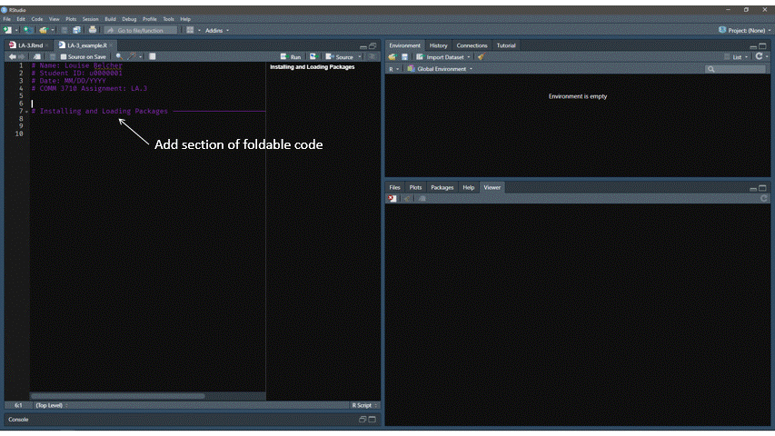

```{r setup, echo=FALSE, warning=FALSE, message=FALSE}
knitr::opts_chunk$set(warning = FALSE, message = FALSE)
library(tidyverse)
library(kableExtra)
```

In this assignment, you will learn how to:

- Create a new R script.
- Prepare your R script for your assignment.
- Create foldable/collapsible headers in your R script.
- Set your working directory.
- Install and load packages in R.
- Open a help page in R.
- Manually enter data into R.
- Look at the contents of a data frame or tibble.
- Identify variables and their types in a tibble.

---

# Step 1 {.tabset .tabset-fade}
## Instructions
Read [Ch. 3 of COMM 3710: Getting Started with R](https://sarakyeo.github.io/COMM-3710-bookdown/docs/setup.html).


# Step 2 {.tabset .tabset-fade}
## Instructions
Create a new R script.

## Hint
Revisit [Step 1] if you are unsure how to create a new R script.


# Step 3 {.tabset .tabset-fade}
## Instructions
Prepare your R script. In the first four (4) lines of your script, include the following, each on a new line, as a comment:

- Full name
- Student ID (uXXXXXXX)
- Date (MM/DD/YY)
- Assignment name

## Hint
Review the resource in Step 1 to learn how to write comments in R.

> **Comments** (which are preceded by "#" in your R script) are not run or executed by R. R will only run/execute **commands a.k.a. functions** (not preceded by "#").


# Step 4 {.tabset .tabset-fade}
## Instructions
Make a section of foldable code titled "Installing and loading packages." Under this heading, **write pseudocode** in preparation to install and load the following packages:

- `tidyverse`
- `magrittr`
- `summarytools`
- `rstatix`

> **Pseudocode** is the plain English version of your R code that described the steps you are taking in R. It should be written as comments in your R script and should be logical.


Then, write commands to **install** the above packages and **load** them into your current session of R.


> Once you have written the R commands, highlight all of them and click the **Run** button. You will do this each time you wish to run commands.

---


## Hint
[Sections 2.3.5 and 2.3.6](https://sarakyeo.github.io/COMM-3710-bookdown/docs/start.html#packages) in COMM 3710: Getting Started with R should help.

Example pseudocode for installing and loading your packages:
```
# Install the package, tidyverse
# Install the package, magrittr
# Install the package, summarytools
# Install the package, rstatix
# Load tidyverse
# Load magrittr
# Load summarytools
# Load rstatix
```

Use this [template](https://utah.instructure.com/files/121254294/download?download_frd=1) to help organize your R script.

# Step 5 {.tabset .tabset-fade}
## Instructions
Create another foldable section labeled "Set working directory." In this section, write pseudocode to set your working directory to the "lab assignments" folder that you set up in [LA-1](https://sarakyeo.gituhub.io/COMM-3710/LA/LA-1.html).

Then, write the R command to set your working directory and run it.

Save your R script as `LA-3_FirstName-LastName.R`.

## Hint
Use the resource in Step 1 if you need help setting your working directory.

You can also use the shortcut key (Win/Mac: Ctrl + Shift + H).


# Step 6 {.tabset .tabset-fade}
##  Instructions
In the next step, we will enter data into R manually using the `c()` function, which is short for `combine()`. Before we do so, let's learn about the function we will be using.

Create a new foldable section in your code for this--give it an appropriate heading.

Write pseudocode to pull up the help documentation for the `c()` function (e.g., "exploring the c() function before using it").

Then, write and run the R command (`?c`) that opens the documentation in your R script. 

Use the results to describe the `c()` function from the documentation as a comment under your `?c` command. You can copy and paste the text under "Description" from the documentation, but I encourage you to add your own description so that you understand what the function is doing.

## Hint
Remember that `?` before any function in R will open the documentation for that function. I recommend that you use this any time you are unsure what a R function does.

# Step 7 {.tabset .tabset-fade}
## Instructions
Time to enter the data!

Write pseudocode to enter the data in the table below as four (4) objects called `Aname`, `Ateam`, `ppg`, and `pts`, respectively.

> Writing pseudocode as comments before actual code should become a habit as you will need to do this in all your assignments for this course.

Then, use the `c()` function to enter the data below into four (4) objects called 

```{r data, echo=FALSE, warnings=FALSE}
Aname <- c("C. Clark", "A. Hayes", "C. Hooks", "K. Bell", "A. Joens")
Ateam <- c("Iowa", "Middle Tenn", "Ohio", "FGCU", "Iowa State")
ppg <- c(26.6, 26.5, 25.1, 24.3, 24.2)
pts <- c(799, 663, 628, 632, 678)
df <- tibble(Aname, Ateam, ppg, pts)

df %>% 
  kable(caption = "2021 data of top 5 women's college basketball players by points per game.") %>% 
  kable_classic(full_width = FALSE, html_font = "Arial")
```

After writing code in your R script, remember to **run** it.

## Hint
There are two data types in the data table, numeric and character. To enter these data types into objects, review [Section 2.4.2](https://sarakyeo.github.io/COMM-3710-bookdown/docs/start.html#data-types) in the book.


# Step 8 {.tabset .tabset-fade}
## Instructions
Check that you have created the objects correctly by calling each object. Calling an object in R allows you to see it in the Console. Write pseudocode for this, followed by the R command to call each object (`Aname`, `Ateam`, `ppg`, `pts`).

Then, combine the objects into a single data frame that has a name of your choosing and look at the dataframe. Use the `tibble()` function to do this. Again, pseudocode and R code should be included in your script.

The data in the tibble should match the information in the table in [Step 7].

## Hint
To call an object, type the name of the object in the Console and press Enter. Or type the name of the object in your R script, then highlight and run it.

The pseudocode and R code below is generic. This means that you will have to replace the placeholders (e.g., `obj1`, `obj2`, `df`) with names of the objects in your R environment.

```
# Calling obj1 to check that I have created it correctly
obj1

# Put obj1, obj2, etc. into a tibble (tidyverse-style data frame) 
df <- tibble(obj1, obj2, obj3, ...)
```


# Step 9 {.tabset .tabset-fade}
## Instructions
Now, we will examine the type of data stored in each column of our data frame. To do this, we will use the `class()` function.

Write pseudocode and R code to examine the `class` function. Copy and paste the description of this function as a comment in your R script.

Then, write pseudocode and R code to check the class of each column in your data frame. Run the code you just wrote and note the class of each column of your data frame in a comment.

## Hint
To pull up documentation for a function, see hint in [Step 6]. If necessary, review the [brief section in the book about data types](https://sarakyeo.github.io/COMM-3710-bookdown/docs/start.html#data-types).


To reference a column in a data frame, we use one type of extractor operator, `$`. Let's say I have a data frame called `cats` and I wanted to examine the data type of a column within the `cats` data frame called `cuteness`. To do so, I will use the class function and an extractor operator:

```
class(cats$cuteness)
```


# Step 10
For this last step, we will use a Tutorial that is built into an existing R package.

Install and load the `learnr` package in your current session of R. In the **Tutorial** panel (usually top right with the **Environment** panel), complete the **Data Basics** tutorial.

Include the answers to the questions below in your R script as comments. Clearly label your answers with the question number (e.g., 10a, 10b). You will answer these questions as part of the Data Basics Tutorial. List the answers from your tutorial as comments in your R script.

a) What does the `drv` variable of `mpg` describe? Read the help for `?mpg` to find out.
b) How many rows are in the data frame named `cars`?
c) How many columns are in the data frame named `cars`?
d) Which types of variables does `flights` contain? List all the types that you checked in the tutorial.

---

# Submission
Submit your R script (which should be named `LA-3_FirstName-LastName.R`) to Canvas.

Your R script should:

1) Include code to install and load the packages.
2) Include code to set your working directory.
3) Contain comments and/or pseudocode for every single line of R code.
4) Run in its entirety without errors.

To ensure that your R script runs without errors, you should:

- Save your script.
- Completely shut down RStudio or restart your R session.
- Reopen RStudio, open your `LA-3_FirstName-LastName.R` script.
- Run the entire script by clicking the "Run" button in the top right of the R script.

> **These standards apply to all submissions in this course that require R scripts. You should follow these instructions for preparation, naming, and saving of your R script for *all* of your individual lab assignments.** 

## Examples
An example of how to write pseudocode can be seen in this GIF.^[I am using the Vibrant Ink theme for RStudio.]
