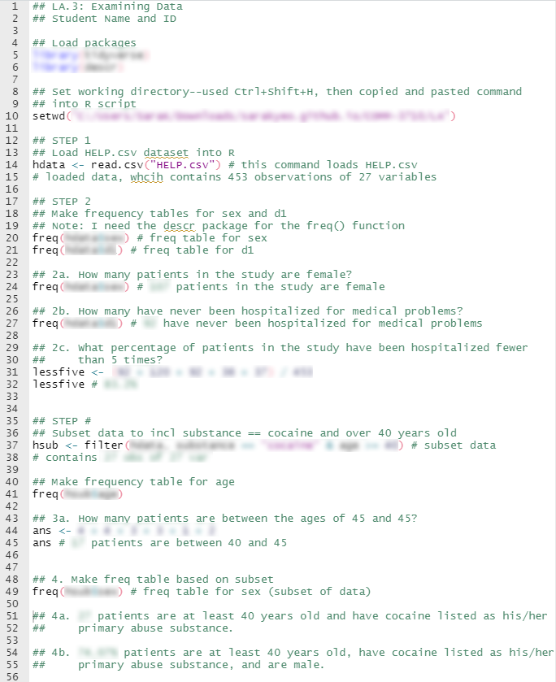

```{r setup, include=FALSE}
library(tidyverse)
library(summarytools)
hdata <- read.csv("HELP.csv")
knitr::opts_chunk$set(echo = FALSE)
```
In this assignment, you will learn how to:

- Run and examine frequency distributions using the `freq()` function in the `summarytools` package.
- View descriptive statistics using the `descr()` function in the `summarytools` package.
- Create new variables from existing variables in a data frame using the `mutate()` function.

> Remember to ...
>
> 1) Set up your R script as you did in LA-4.
> 2) Include a comment for each line of code in your R script. This can be pseudocode or other comments.

---

# Instructions

## Step 1 {.tabset .tabset-fade .tabset-pills}

### Question

Load/Read the [HELP](https://utah.instructure.com/files/117853074/download?download_frd=1) data set into R. This data set is saved as a .csv file.

### Hint

See LA-4 for a reminder of how to load data into R.


## Step 2 {.tabset .tabset-fade .tabset-pills}

### Question

Install the `summarytools` and `tidyverse` packages in R. Then, load the packages.

Make a frequency table for `sex` and `d1`. Include these frequency tables in your submission and answer the questions below.

a. How many patients in the study are female?
b. How many patients in the study have never been hospitalized for medical problems?
c. What percentage of patients in the study have been hospitalized fewer than 5 times?

### Hint

To install and load packages, see this [section of the COMM 3710: Getting Started with R](https://sarakyeo.github.io/COMM-3710-bookdown/docs/start.html#packages) book.

To run a frequency distribution, which creates a frequency table, you will need the `freq()` function in the `summarytools` package. Remember that you can read the documentation for a specific function by typing the function name preceded by `?` in the Console in RStudio. 

Read the documentation for `freq()` by typing `?freq` in the Console.

You might find the [section on working with data frames](https://sarakyeo.github.io/COMM-3710-bookdown/docs/start.html#working-with-data-frames) helpful.

Run the code below to see a frequency distribution for the variable `racegrp` in the HELP data set, which has been read into a data frame called `hdata`.

```{r freq, eval=TRUE, echo=TRUE, prompt=TRUE}
hdata %>% 
        freq(racegrp)
```


## Step 3 {.tabset .tabset-fade .tabset-pills}
### Question
Now, subset the data to only include patients whose primary substance of abuse is cocaine and who are at least 40 years old. Then, make a frequency table for `age`.

a. How many patients are between the ages of 40 and 45?

### Hint
To subset the data, you will use the `filter()` function from the `dplyr` package that is part of the `tidyverse`. Be sure you have installed and loaded the `tidyverse` package.

Read the documentation for the `filter()` function by typing `?dplyr::filter` in the Console. Be sure to check out the examples in the documentation.

The code below subsets the data to include only patients who are housed. To ensure that the subset of data has been created correctly, you can use the the `freq()` function. Change the code to filter the data to include only patients who are male.

```{r filter, eval=TRUE, echo=TRUE, prompt=TRUE}
subdata <- hdata %>% 
        filter(homeless == "housed")
subdata %>% 
        freq(homeless)
```

## Step 4 
Make a frequency table for `sex` based on this subset. Answer the questions below.

a. How many patients in the study are at least 40 years old and have cocaine listed as his/her primary abuse substance?
b. What percentage of patients who are at least 40 years old and have cocaine listed as his/her primary abuse substance are male?


# Submission
Submit your R script (which should be named `LA-5_FirstName-LastName.R`) to Canvas.

Your R script should:

1) Include code to install and load the packages.
2) Include code to set your working directory.
3) Contain comments and/or pseudocode for every single line of R code.
4) Run in its entirety without errors.

To ensure that your R script runs without errors, you should:

- Save your script.
- Completely shut down RStudio or restart your R session.
- Reopen RStudio, open your `LA-5_FirstName-LastName.R` script.
- Run the entire script by clicking the "Run" button in the top right of the R script.

> These standards apply to all submissions in this course that require R scripts.

Sample submission:

```{r sample, echo=FALSE, out.width="80%", fig.align='center'}

```

