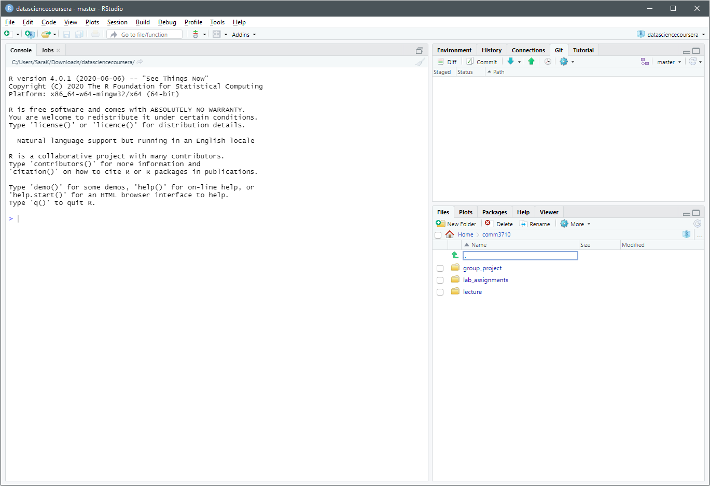
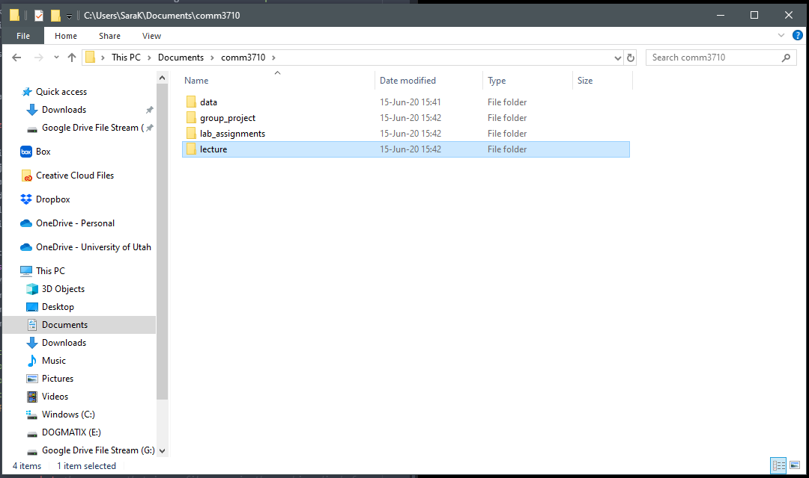

```{r setup, include=FALSE}
knitr::opts_chunk$set(echo = TRUE)
```

[R](https://cran.r-project.org/) is the programming language and environment that we will be using for statistical analysis. It is open-source. For more information on R, you can visit the [R Project for Statistical Computing](https://www.r-project.org/). [RStudio](https://rstudio.com/) is the program through which we will be using R. You will need to download and install both R and RStudio.

# Instructions

Follow the instructions below to download and install R and RStudio. You should also watch this [video](https://youtu.be/ZvPFKfNHBNQ) explaining R and RStudio and how to install both pieces of software.

Once you have R and RStudio installed, create a working directory (this can be anywhere on your computer that you choose, you just need to know where it is [e.g., in your Documents folder]) for COMM 3710 and take a screenshot of your working directory. Next, open RStudio and take a screenshot of the program.

Submit the 2 screenshots in a single PDF document on Canvas. Example screenshots can be found after the instructions.

# Download and Install R

* Open a web browser and navigate to [https://cran.r-project.org](https://cran.r-project.org/).
* Download the appropriate file for your operating system (e.g., Mac OS X, Windows, or Linux).
* Install R by double-clicking on the downloaded file. During installation, select the default settings when prompted.

# Download and Install RStudio

* Open a web browser and navigate to [https://rstudio.com/products/rstudio/download/](https://rstudio.com/products/rstudio/download/).
* Download the free version of RStudio that corresponds to your operating system (e.g., Mac OS X, Windows, Linux).
* Install RStudio by double-clicking on the downloaded file.
   * *Note*: If you are using Mac OS X, double-click the downloaded file, then drag the RStudio icon into your `Applications` folder.
   * When you are done, eject the "drive" that you downloaded by dragging it to the `Trash`.
* Watch this [video](https://rstudio.com/products/rstudio/?wvideo=520zbd3tij) to learn how to navigate RStudio.
* Take a screenshot of RStudio for LA.1.

# Set Preferences in RStudio

* Open RStudio. Click on `Tools` and navigate to `Global Options...`.
* Uncheck the box next to `Restore .RData into workspace at startup`.
* Where it says `Save workspace to .RData on exit:`, select `Never`.
* Click `Apply` and `OK` to exit.
* These settings ensure that R does not carry forward objects (such as data) that you were working on in a prior assignment to a new assignment.
* Make a habit of *completely* shutting down RStudio when you are done working. This will clear the "Environment," which is a good thing.

# Organize Your Working Directory

* A working directory is a computer folder that contains all your materials related to a project (e.g., this course).
* Using a consistent folder structure across your projects will help keep things organized, and will also make it easy to find/file things in the future. This can be especially helpful when you have multiple projects. In general, you may create directories (folders) for **scripts**, **data**, and **documents**.
* Set up a working directory. Choose a naming convention for your class folder and stick with it. Some recommendations (*Note: While the options below look similar, R is case-sensitive, i.e., the folder names below are not the same!*):
   * COMM3710
   * comm3710
   * comm_3710
   * Comm3710
* Create four subfolders in your working directory: \newline
  1. `lecture` to store notes and documents related to lecture content.
  2. `lab_assignments` to store your lab assignments.
  3. `group_project` for assignments related to your group project.
  4. `data` for storing data files.
* **All files related to this course should be stored in this working directory**.
* Take a screenshot of your working directory for LA.1.

\newpage

# Sample screenshots<!-- ensure that image files are in the working dir before knitting -->

## RStudio screenshot


\newpage

## Working directory screenshot

