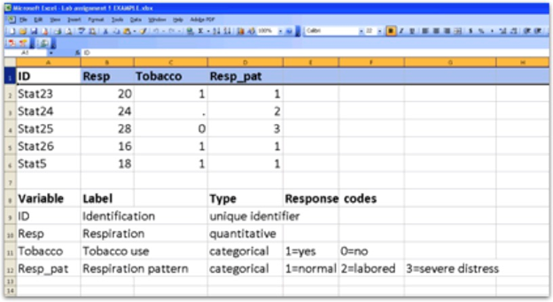

Although you will be working with previously collected data, it is important to understand what data looks like as well as how it is coded and entered into a spreadsheet or data set for analysis.

# Instructions
Use the [medical records](https://utah.instructure.com/files/109758959/download?download_frd=1) for 5 patients seeking treatment in a hospital emergency room to accomplish the following:

- Select 4 variables recorded on the medical forms (one should be a unique identifier, at least one should be a quantitative variable and at least one should be a categorical variable).
- Select a brief name (ideally 8 characters or less) for each variable.
- Determine what range of values is needed for recording each variable (create dummy codes as needed).
- Label variables within an Excel spreadsheet.
- Enter data for each patient in the Excel spreadsheet.
- List the variable names, labels, types, and, response codes below the data set (i.e. the code book).
- Submit the excel file (.XLS, .XLSX) on Canvas.

# Sample Submission

