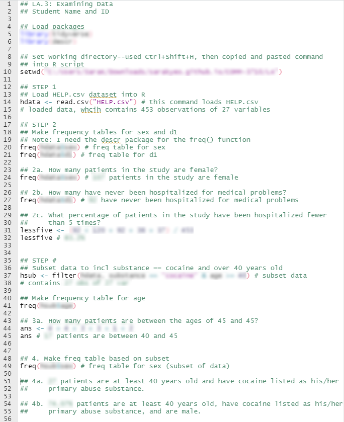

```{r setup, include=FALSE}
library(learnr)
library(tidyverse)
library(descr)
hdata <- read.csv("HELP.csv")
knitr::opts_chunk$set(echo = FALSE)
```

## Resources

- [COMM 3710: Getting Started with R](https://sarakyeo.github.io/COMM-3710-bookdown/docs)
- [COMM 3710 Slack workspace]() (see Canvas for instructions on how to join)
- [Video 04: Working with Data](https://youtu.be/Dbj_l1PRIjA)

---

## Data

For this assignment, you will be working with the [Health Evaluation and Linkage to Primary Care (HELP) data set](https://utah.instructure.com/files/108105219/download?download_frd=1). Submit your answers as a PDF document on Canvas.

The HELP study was a clinical trial for adult inpatients recruited from a detoxification unit. Patients with no primary care physician were randomized to receive a multidisciplinary assessment and a brief motivational intervention or usual care, with the goal of linking them to primary medical care.

The data set contains 453 observations on the following variables:

* `age`: Subject age at baseline (in years)
* `anysub`: Use of any substance post-detox (a factor with levels no yes)
* `cesd`: Center for Epidemiologic Studies Depression measure at baseline (high scores indicate more depressive symptoms)
* `d1`: lifetime number of hospitalizations for medical problems (measured at baseline)
* `daysanysub`: time (in days) to first use of any substance post-detox
* `dayslink`: time (in days) to linkage to primary care
* `drugrisk`: Risk Assessment Battery drug risk scale at baseline
* `e2b`: number of times in past 6 months entered a detox program (measured at baseline)
* `female`: 0 for male, 1 for female
* `sex`: a factor with levels male female
* `g1b`: experienced serious thoughts of suicide in last 30 days (measured at baseline; a factor with levels no yes)
* `homeless`: housing status: a factor with levels housed homeless
* `i1`: average number of drinks (standard units) consumed per day, in the past 30 days (measured at baseline)
* `i2`: maximum number of drinks (standard units) consumed per day, in the past 30 days (measured at baseline)
* `id`: subject identifier
* `indtot`: Inventory of Drug Use Consequences (InDUC) total score (measured at baseline)
* `linkstatus`: post-detox linkage to primary care (0 = no, 1 = yes)
* `link`: post-detox linkage to primary care: no yes
* `mcs`: SF-36 Mental Component Score (measured at baseline, lower scores indicate worse status)
* `pcs`: SF-36 Physical Component Score (measured at baseline, lower scores indicate worse status)
* `pss_fr`: perceived social support by friends (measured at baseline, higher scores indicate more support)
* `racegrp`: race/ethnicity: levels black hispanic other white
* `satreat`: any BSAS substance abuse treatment at baseline (no yes)
* `sexrisk`: Risk Assessment Battery sex risk score (measured at baseline)
* `substance`: primary substance of abuse (alcohol cocaine heroin)
* `treat`: randomized to HELP clinic (no yes)

---

## Instructions

### Step 1 {.tabset .tabset-fade .tabset-pills}

#### Question

Load/Read the [HELP](https://utah.instructure.com/files/108105219/download?download_frd=1) data set into R. This data set is saved as a .csv file.

#### Hint

To load/read data into R, see [Chapter 3](https://sarakyeo.github.io/COMM-3710-bookdown/docs/setup.html#assignment-r-script-checklist) of the book, COMM 3710: Getting Started with R.


### Step 2 {.tabset .tabset-fade .tabset-pills}

#### Question

Install the `descr` and `tidyverse` packages in R. Then, load the packages.

Make a frequency table for `sex` and `d1`. Include these frequency tables in your submission and answer the questions below.

a. How many patients in the study are female?
b. How many patients in the study have never been hospitalized for medical problems?
c. What percentage of patients in the study have been hospitalized fewer than 5 times?

#### Hint

To install and load packages, see this [section of the COMM 3710: Getting Started with R](https://sarakyeo.github.io/COMM-3710-bookdown/docs/start.html#packages) book.

To run a frequency distribution, which creates a frequency table, you will need the `freq()` function in the `descr` package. Remember that you can read the documentation for a specific function by typing the function name preceded by `?` in the Console in RStudio. 

Read the documentation for `freq()` by typing `?freq` in the Console.

You might find the [section on working with data frames](https://sarakyeo.github.io/COMM-3710-bookdown/docs/start.html#working-with-data-frames) helpful.

**Try it out:** Run the code below to see a frequency distribution for the variable `anysub` in the HELP data set, which has been read into a data frame called `hdata`. Change the argument within the `freq()` function to see the frequency distribution of the variable, `racegrp`.

```{r freq, exercise=TRUE}
freq(hdata$anysub)
```


### Step 3 {.tabset .tabset-fade .tabset-pills}
#### Question
Now, subset the data to only include patients whose primary substance of abuse is cocaine and who are at least 40 years old. Then, make a frequency table for `age`.

a. How many patients are between the ages of 40 and 45?

#### Hint
To subset the data, you will use the `filter()` function from the `dplyr` package that is part of the `tidyverse`. Be sure you have installed and loaded the `tidyverse` package.

Read the documentation for the `filter()` function by typing `?dplyr::filter` in the Console. Be sure to check out the examples in the documentation.

**Try it out:** The code below subsets the data to include only patients who are housed. To ensure that the subset of data has been created correctly, you can use the the `freq()` function. Change the code to filter the data to include only patients who are male.

```{r filter, exercise=TRUE}
subdata <- filter(hdata, homeless == "housed")
freq(subdata$homeless)
```

### Step 4 
Make a frequency table for `sex` based on this subset. Answer the questions below.

a. How many patients in the study are at least 40 years old and have cocaine listed as his/her primary abuse substance?
b. What percentage of patients who are at least 40 years old and have cocaine listed as his/her primary abuse substance are male?


## Submission
Submit a **.R file** containing the following on Canvas:

- R code/commands used to complete this assignment. Your R script should include annotations that explain your thought process as you work through the assignment.
- Clearly labeled answers to questions as comments/annotations in the R script.

Sample submission:

```{r sample, echo=FALSE, out.width="80%", fig.align='center'}

```

