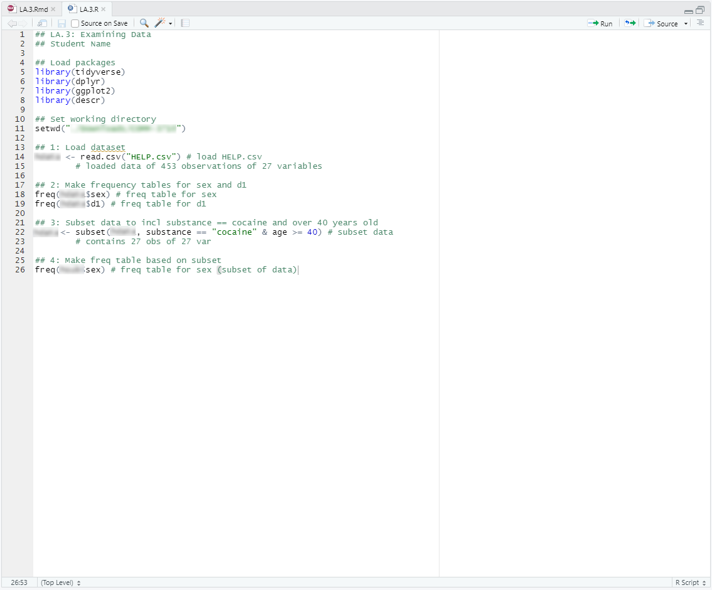
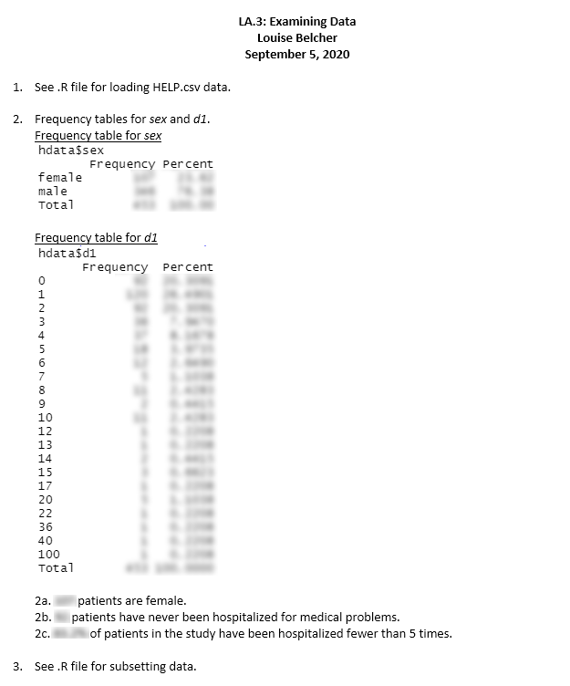

# Resources
- Before you begin, watch this [video](https://youtu.be/Dbj_l1PRIjA) on working with R. Keep this link at hand--you will likely have to watch the video and refer to it more than once throughout the assignment and course.
- Additional resources can be found [here](https://rpubs.com/yesun/652965) and on Canvas.

---

# Data
For this assignment, you will be working with the [Health Evaluation and Linkage to Primary Care (HELP) data set](https://utah.instructure.com/files/102658359/download?download_frd=1). Submit your answers as a PDF document on Canvas.

The HELP study was a clinical trial for adult inpatients recruited from a detoxification unit. Patients with no primary care physician were randomized to receive a multidisciplinary assessment and a brief motivational intervention or usual care, with the goal of linking them to primary medical care.

The data set contains 453 observations on the following variables:

* `age`: Subject age at baseline (in years)
* `anysub`: Use of any substance post-detox (a factor with levels no yes)
* `cesd`: Center for Epidemiologic Studies Depression measure at baseline (high scores indicate more depressive symptoms)
* `d1`: lifetime number of hospitalizations for medical problems (measured at baseline)
* `daysanysub`: time (in days) to first use of any substance post-detox
* `dayslink`: time (in days) to linkage to primary care
* `drugrisk`: Risk Assessment Battery drug risk scale at baseline
* `e2b`: number of times in past 6 months entered a detox program (measured at baseline)
* `female`: 0 for male, 1 for female
* `sex`: a factor with levels male female
* `g1b`: experienced serious thoughts of suicide in last 30 days (measured at baseline; a factor with levels no yes)
* `homeless`: housing status: a factor with levels housed homeless
* `i1`: average number of drinks (standard units) consumed per day, in the past 30 days (measured at baseline)
* `i2`: maximum number of drinks (standard units) consumed per day, in the past 30 days (measured at baseline)
* `id`: subject identifier
* `indtot`: Inventory of Drug Use Consequences (InDUC) total score (measured at baseline)
* `linkstatus`: post-detox linkage to primary care (0 = no, 1 = yes)
* `link`: post-detox linkage to primary care: no yes
* `mcs`: SF-36 Mental Component Score (measured at baseline, lower scores indicate worse status)
* `pcs`: SF-36 Physical Component Score (measured at baseline, lower scores indicate worse status)
* `pss_fr`: perceived social support by friends (measured at baseline, higher scores indicate more support)
* `racegrp`: race/ethnicity: levels black hispanic other white
* `satreat`: any BSAS substance abuse treatment at baseline (no yes)
* `sexrisk`: Risk Assessment Battery sex risk score (measured at baseline)
* `substance`: primary substance of abuse (alcohol cocaine heroin)
* `treat`: randomized to HELP clinic (no yes)

---

# Instructions
1. Load in the [HELP.csv data set](https://utah.instructure.com/files/108105219/download?download_frd=1)<!--change link for each section-->, which can be found on Canvas.
<details>
<summary>Hint</summary>

   The command to read a .csv data file to an object named `helpdata` in R is:
   ```
   helpdata <- read.csv("HELP.csv")
   ```
</details>

```{r message=FALSE, warning=FALSE, include=FALSE}
## Install packages
library(descr)
library(tidyverse)

## Change working directory
setwd("C:/Users/SaraK/Downloads/sarakyeo.github.io/COMM-3710/LA")

## Load HELP dataset
hdata <- read.csv("HELP.csv")

```

<br>

2. Make a frequency table for `sex` and `d1`. Include this frequency table in your submission and answer the questions below.
      a. How many patients in the study are female?
      b. How many patients in the study have never been hospitalized for medical problems?
      c. What percentage of patients in the study have been hospitalized fewer than 5 times?

   <details>
   <summary>Hint</summary>
   
      The package(s) and command(s) necessary to create frequency tables in R can be found in the video linked at the beginning of these instructions.
   </details>
<br>

3. Now, subset the data to only include patients whose primary substance of abuse is cocaine and who are at least 40 years old.
<details>
<summary>Hint</summary>
   
   The subset argument should be `substance == "cocaine" & age >= 40`
</details>
<br>

4. Make a frequency table for sex based on this subset. Include this frequency table in your submission and answer the questions below.
      a. How many patients in the study are at least 40 years old and have cocaine listed as his/her primary abuse substance?
      b. What percentage of patients who are at least 40 years old and have cocaine listed as his/her primary abuse substance are male?

<br>

5. Submit the following on Canvas. Sample submissions are included below.
   (a) A **.R file** containing the code used to complete this assignment. This document should include comments that explain your commands (see example submission).
   (b) A **PDF file** containing the answers to each question--clearly label the answers with the question number.

---

# Sample Submission {.tabset .tabset-fade}

Note that the screenshots below do not contain the answers to LA.3. Your submission **should** contain answers to the questions in the assignment that are **clearly labeled**.

## Screenshot of .R file example


## Screenshot of PDF file example

